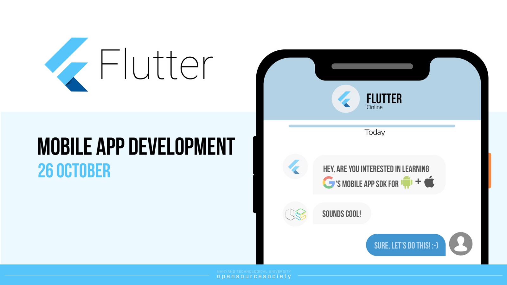
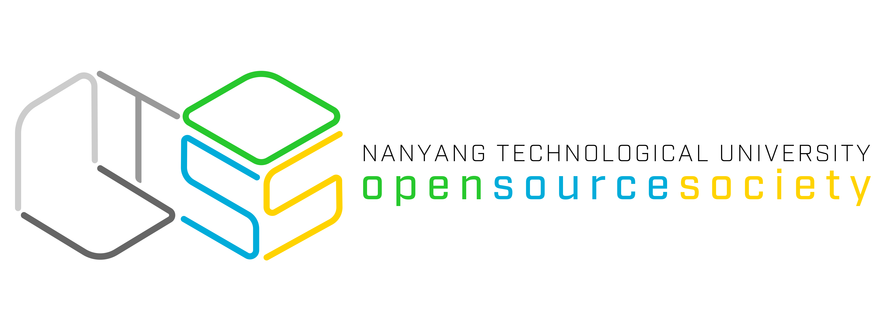
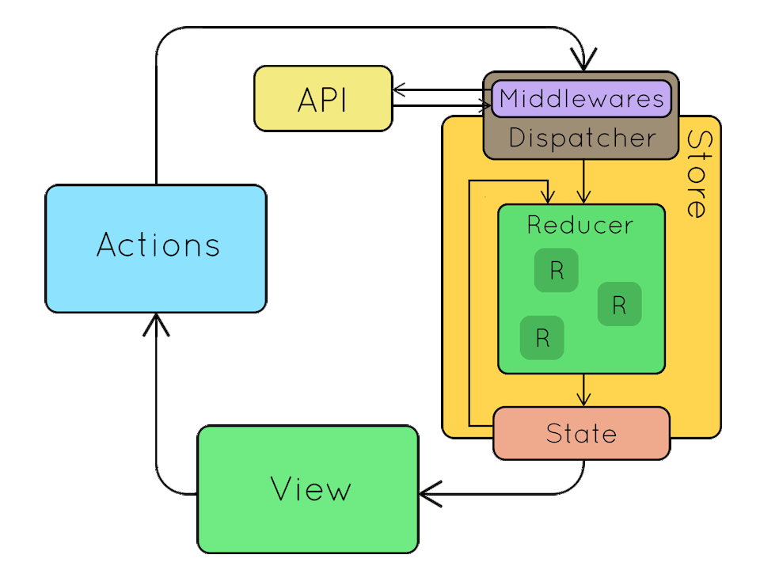

# NTUOSS Flutter Workshop

**By [Zayn Jarvis](https://github.com/ZaynJarvis) from [NTU Open Source Society](https://www.ntuoss.com)**




Artwork by Chuan Bin

---

| Workshop Details |                                                                                       |
| :---:            | ---                                                                                   |
| When             | Friday, 26 Oct 2018. 6:30 PM - 8:30 PM                                                |
| Where            | LT1, NTU North Spine Plaza                                                            |
| Who              | NTU Open Source Society                                                               |
| Questions        | We will be hosting a Pigeon Hole Live for collecting questions regarding the workshop |


Feedback & Error Reports: We will send out the link for collecting feedback as usual. ​For further discussion or cooperation please contact [zaynjarvis@gmail.com](zaynjarvis@gmail.com).

**_Disclaimer: This workshop is for educational purposes only. The redux framework is forked from [brianegan/flutter_architecture_samples](https://github.com/brianegan/flutter_architecture_samples). And information regarding Unity concepts are retrieved from [Flutter Document](https://flutter.io). No prototype or outcome of any type is intended for commercial use._**

---
## Setup

* Flutter & Dart Compiled Code

   Please download Flutter & Dart for development from [here](https://flutter.io/get-started/install/), and follow the instruction to complete the configuration for either iOS/Android development.

   For now, the latest release of Flutter is [Flutter Release Preview 2.](https://developers.googleblog.com/2018/09/flutter-release-preview-2-pixel-perfect.html).

   The next version of Flutter will finally be 1.0 🎉

   **Warning: We highly recommend you to download and config Flutter prior to coming to this workshop as it may take 30 - 60 minutes to complete the process. If you do not have Flutter correctly installed, you might only be able to attend an info-session of mobile app dev in Flutter rather than a hands-on session.**

* Visual Studio Code (or Xcode, Android Studio, IntelliJ for Dart Programming)

    Use the recommended editor/IDE for Flutter development. Refer to [here](https://flutter.io/get-started/editor/).

* Complete Setup
    
    Use `flutter doctor` in your terminal/cmd to check everything is correct with at least one editor/IDE is working.

---

### Agenda
* [Live Streaming Site](#project-0)
* [Introduction to Mobile App Development Framework: Flutter](#flutter)
    * Key Advantages:
        * Hot reload
        * Cross Platform
        * Compiled to Native Code
        * Support untyped and typed data declaration
    * Key differences:
        * No built-in UI designing Kit
        * Inline styles
        * Special Cupertino Style Component for iOS development.
* [`Hello World App` of Flutter](#hello-world)
    * Classes in Flutter
    * State Machine in Flutter
    * Data arguments in Classes
    * Class initialization shortcut
    * Add assets
    * Unit testing in Flutter
* [`Currency App` build from scratch](#currency)
    * HTTP request in Flutter
    * Local storage using SQFlite Database
    * Code Factorization and Redux
    * Change app icon and app name for deployment
* [`TODO App` Redux framework in Flutter](#todo)
    * Store & State
    * Actions
    * Reducers
    * Middleware
    * Dispatch
    * ViewModel
* [`Speech Recognition App` Method Channel](#voice-recognition)
    * Implement native APIs that Flutter does not support

---

## Live Streaming:

[](https://www.youtube.com/watch?v=WHGb2NOMiQ0)

## Flutter
* Key Advandatages:
    * Hot reload 
    * Cross Platform
    * Compiled to Native Code
    * Support untyped and typed data declaration 
    > `var`, `dynamic` vs `String`, `double`, `Map<String, double>`
    * build-in unit testing

* Key differences:
    * No built-in UI designing Kit
    * Inline styles
    > `Colors`, `Alignment`, `EdgeInsect`
    * Extended styles
    > `TextDecoration` and `AnimationController`
    * Gesture control
    > `GestureDetector`
    * [Cupertino Style Component for iOS development](https://flutter.io/widgets/cupertino/)

**use `git checkout <branch-name>` to get the source code of different apps**

---
## HELLO WORLD
```bash
# > To view the source code.
$ git checkout feature/currencyapp
```
* `Hello World App` of Flutter
    * Classes in Flutter
    * State Machine in Flutter
    * Arguments in Stateful Classes
    * Class initialization shortcut
    * Add assets
    * Unit testing in Flutter

With Flutter installed, Check everything is correct with 
```bash
$ flutter doctor
Doctor summary (to see all details, run flutter doctor -v):
[✓] Flutter (Channel beta, v0.9.4, on Mac OS X 10.14 18A391, locale en-SG)
[✓] Android toolchain - develop for Android devices (Android SDK 28.0.1)
[✓] iOS toolchain - develop for iOS devices (Xcode 10.0)
[✓] Android Studio (version 3.1)
[✓] IntelliJ IDEA Community Edition (version 2018.2)
[✓] VS Code (version 1.28.2)
[✓] Connected devices (1 available)

• No issues found!
```
> If you do not have connected devices error, connect your phone to computer (For iOS developer make sure your device has trusted your computer to install app on in. Read [here](https://flutter.io/setup-macos/#platform-setup).)

> You can connect a simulator(Xcode) or an emulator(Android Studio) for development as well.

Then we can get started by running
```bash
flutter create myapp
```
This command will create a flutter project folder for you named `myapp`

Then we can change directory into our project folder and start to run the project
```bash
$ cd myapp
$ flutter run
```
Now you should have a counter app running in your device.


---
## CURRENCY
```bash
$ # > To view the source code.
$ git checkout feature/currencyapp
$ git log --oneline
e5c3b21 integrate with redux framework
d097c30 local database integration
35dc753 slidable component with delete and rebase function
34bf7f7 add price controller
67e5f8a http request for country exchange rate
40c264c currency app layout
```
* `Currency App` build from scratch
    * HTTP request in Flutter
        ```bash
        $ git checkout 67e5f8a
        ```
    * Local storage using SQFlite Database
        ```bash
        $ git checkout d097c30
        ```
    * Code Factorization and Redux
        ```bash
        $ git checkout e5c3b21
        ```
        Checkout this [link](https://blog.gisspan.com/2017/02/Redux-Vs-MVC,-Why-and-How.html) for more on redux.
        
    * Change app icon and app name for deployment
        ```bash
        $ git checkout 1c269b9
        ```    
---

### TODO
```bash
$ # > To view the source code.
$ cd .. # Go back to the parent directory
$ git clone https://github.com/brianegan/flutter_architecture_samples.git
$ cd flutter_architecture_samples/example/firestore_redux
$ code . # if you have VScode installed
```

* `TODO App` Redux framework in Flutter
    * Store & State
    * Actions
    * Reducers
    * Middleware
    * Dispatch
    * ViewModel

--- 
### VOICE RECOGNITION
* `Speech Recognition App` Method Channel
    * Implement native APIs that Flutter does not support

We can make use of `MethodChannel` in both platform.

Checkout the repository [here](https://github.com/ZaynJarvis/Flutter-Speech-Recognition)


> In Flutter (Dart), we create the channel we will use. In this case, a generic name `speech_recognizer`. Then we specify the function to integrate with native APIs.

```dart
import 'dart:async';

import 'package:flutter/services.dart';

const MethodChannel _speech_channel =
    const MethodChannel("speech_recognizer");

class SpeechRecognizer {
  static void setMethodCallHandler(handler) {
    _speech_channel.setMethodCallHandler(handler);
  }

  static Future activate() {
    return _speech_channel.invokeMethod("activate");
  }

  static Future start(String lang) {
    return _speech_channel.invokeMethod("start", lang);
  }

  static Future cancel() {
    return _speech_channel.invokeMethod("cancel");
  }

  static Future stop() {
    return _speech_channel.invokeMethod("stop");
  }
}
```
> In Android (Java), we connect to the channel `speech_recognizer` to receive message. Then deal with the method call received from Flutter.

```java
public class MainActivity extends FlutterActivity implements RecognitionListener {

    private static final String SPEECH_CHANNEL = "speech_recognizer";
    private static final String LOG_TAG = "SPEAKTEST";
    private SpeechRecognizer speech;
    private MethodChannel speechChannel;
    String transcription = "";
    private boolean cancelled = false;

    @Override
    protected void onCreate(Bundle savedInstanceState) {
        super.onCreate(savedInstanceState);
        GeneratedPluginRegistrant.registerWith(this);

        speech = SpeechRecognizer.createSpeechRecognizer(getApplicationContext());
        speech.setRecognitionListener(this);

        final Intent recognizerIntent = new Intent(RecognizerIntent.ACTION_RECOGNIZE_SPEECH);
        recognizerIntent.putExtra(RecognizerIntent.EXTRA_PARTIAL_RESULTS, true);
        recognizerIntent.putExtra(RecognizerIntent.EXTRA_MAX_RESULTS, 3);

        speechChannel = new MethodChannel(getFlutterView(), SPEECH_CHANNEL);
        speechChannel.setMethodCallHandler(
                new MethodChannel.MethodCallHandler() {
                    @Override
                    public void onMethodCall(MethodCall call, MethodChannel.Result result) {
                        switch(call.method){
                            case "activate":
                                result.success(true);
                                break;
                            case "start":
                                cancelled = false;
                                speech.startListening(recognizerIntent);
                                result.success(true);
                                break;
                            case "cancel":
                                speech.stopListening();
                                cancelled = true;
                                result.success(true);
                                break;
                            case "stop":
                                speech.stopListening();
                                cancelled = false;
                                result.success(true);
                                break;
                            default:
                                result.notImplemented();
                        }
                    }
                }
        );
    }
}
```
```swift
import UIKit
import Flutter
import Speech

@UIApplicationMain
class AppDelegate: FlutterAppDelegate, SFSpeechRecognizerDelegate {

  private let speechRecognizerEn = SFSpeechRecognizer(locale: Locale(identifier: "en_US"))!

  private var speechChannel: FlutterMethodChannel?

  private var recognitionRequest: SFSpeechAudioBufferRecognitionRequest?

  private var recognitionTask: SFSpeechRecognitionTask?

  private let audioEngine = AVAudioEngine()

  override func application(
     _ application: UIApplication,
     didFinishLaunchingWithOptions launchOptions: [UIApplicationLaunchOptionsKey: Any]?) -> Bool {

    let controller: FlutterViewController = window?.rootViewController as! FlutterViewController

    speechChannel = FlutterMethodChannel.init(name: "speech_recognizer",
       binaryMessenger: controller)
    speechChannel!.setMethodCallHandler({
      (call: FlutterMethodCall, result: @escaping FlutterResult) -> Void in
      if ("start" == call.method) {
        self.startRecognition(lang: call.arguments as! String, result: result)
      } else if ("stop" == call.method) {
        self.stopRecognition(result: result)
      } else if ("cancel" == call.method) {
        self.cancelRecognition(result: result)
      } else if ("activate" == call.method) {
        self.activateRecognition(result: result)
      } else {
        result(FlutterMethodNotImplemented)
      }
    })
    return true
  }
}
```

